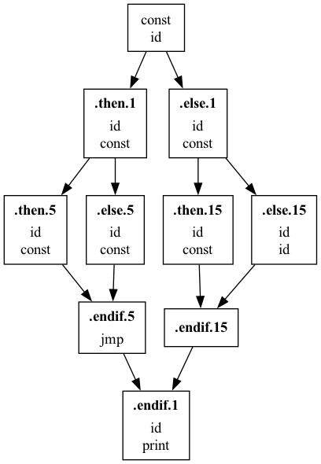
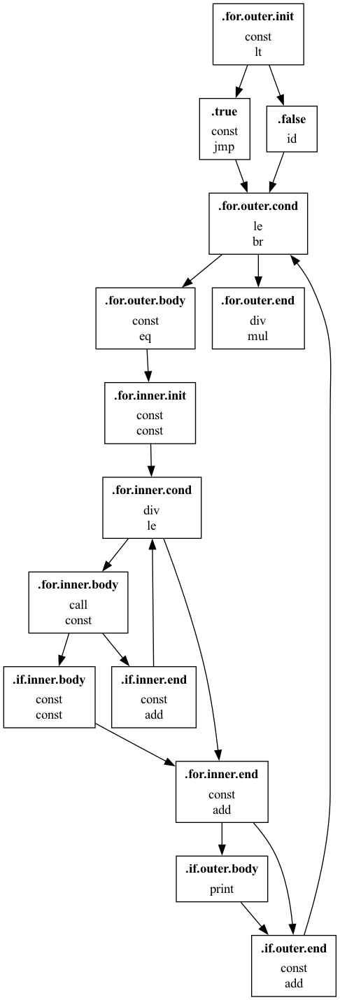

### Bril Analyzer

This program analyzes op counts of the input bril json file and is able to summarize the control flow graph (cfg) in dot graph format. User may choose visualize the cfg with their favorite graphviz tools.


#### Options

* `-f`: specifies the path to input bril json file

* `--cfg`: outputs cfg of input bril in dot format to `stdout`
* `--op`: outputs op counts 

#### How to run

```shell
$ cargo build --release
# pipe cfg output to dot command for rendering
$ ./target/release/bril-analyzer --cfg -f ${your_bril_json} | dot -Tpng -o cfg.png 
```

#### Examples

```typescript
// nested-if-else.ts, sample ts script which will be compiled into bril
var n: bigint = 3n;
nested_if_else(n);
function nested_if_else(n: bigint) {
    var a: bigint = 3n;
    if (n < 10n) {
        if (n > 5n) {
            n = n + 1n;
        } else {
            n = n * 10n;
        }
    } else {
        if (n > 20n) {
            n = n * 100n;
        } else {
            n = n;
        }
    }
    console.log(n)
}

// op counts for compiled bril
// id:     15
// const:  10
// br:     3
// jmp:    3
// mul:    2
// gt:     2
// add:    1
// call:   1
// print:  1
// lt:     1
```

##### generated cfg



[benchmakrs/core/prime-between](https://github.com/sampsyo/bril/blob/main/benchmarks/core/primes-between.bril)

